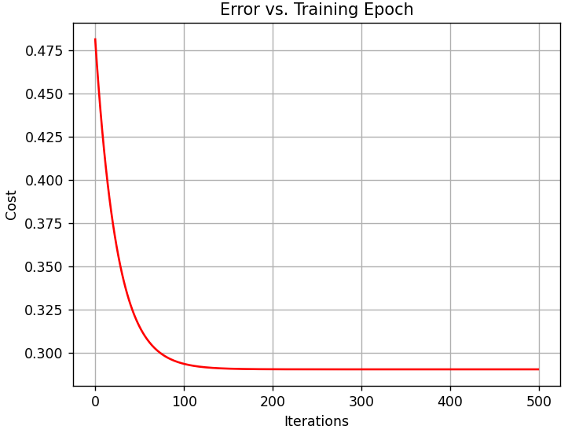

# Multivariate Linear Regression

This code is an example of multivariate linear regression

The graph below shows that the cost drops with each iteration and then at 150-200th iteration it flattens out, which is where we say the model has converged. It is where the cost is as low as it can be and cannot be minimised any further with the current algorithm.

